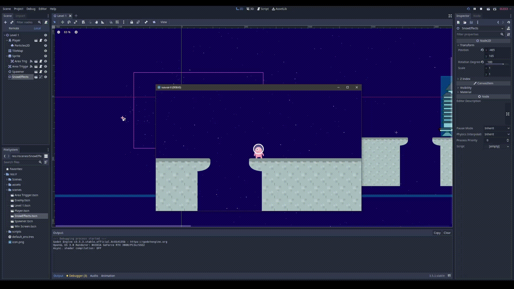

# Game Dev Tutorial 8

    <a href="https://github.com/sponsors/alexandresanlim">
        
            

                <h2>v3.5.3 LTS</h2>
            
  
    </a>

## 🗺️ Latihan Mandiri - Rencana Polishing & Balancing Pada Game Proyek Kelompok 🗺️

- ### Apa saja hal-hal positif yang kamu identifikasi dari pengalaman para pemain ketika mencoba game kelompok?

    > Based on responden feels about the game approach
    
    Para tester memiliki perasaan yang bervariasi ketika bermain Something Left to Lose. Mereka merasa familiar dengan gaya permainan RPG indie dan menemukan seni yang unik dan menarik.

- ### Apa saja hal-hal negatif (atau, pain points) yang kamu identifikasi dari pengalaman para pemain ketika mencoba game kelompok?

    > Based on responden pain points while playtesting
    
    Para tester merasa gameplay yang cukup singkat, dengan kurangnya konten interactivity dalam most level serta beberapa guidance dalam level yang membuatnya hampir tidak memerlukan adanya eksplorasi lebih lanjut.

- ### Dari feedback-feedback yang telah diperoleh, apakah ada isu yang terkait pencapaian kondisi flow oleh pemain?

    > Based on responden given ideas
    
    Beberapa kasus seperti flow antara akses point dari level 1 ke level 2 yang masih cukup aneh serta pendapat bahwa kucing yang kurang intimidating sebagai sosok pengejar yang harus dihindari di level 2 & 3.

- ### Dari jawaban kamu terhadap pertanyaan 1 hingga 3, tuliskan secara singkat, dalam bentuk bullet points, apa saja hal yang ingin kamu polish dan balance?

    > In Summary
    
    1. Perlu meningkatkan konten interaktif dalam sebagian besar level untuk meningkatkan eksplorasi dan meningkatkan durasi gameplay.

    2. Perlu memberikan petunjuk yang lebih jelas dalam level untuk menghindari kebingungan tentang alur permainan dan akses antar level.

    3. Kucing pengejar perlu diubah agar terlihat lebih menakutkan atau menantang untuk menambah tingkat ketegangan dan kesulitan dalam permainan.

##
## 🖮 Control & Keybinds 🖮

> As per usual, i decided to rebind the main control keys for our convenience.

- *W* / *Space* = Jump

- *A* / ⇦ = Move left

- *D* / ⇨ = Move right

##
## PS & Cheers <3

